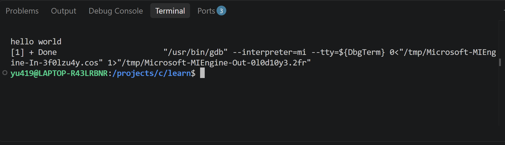
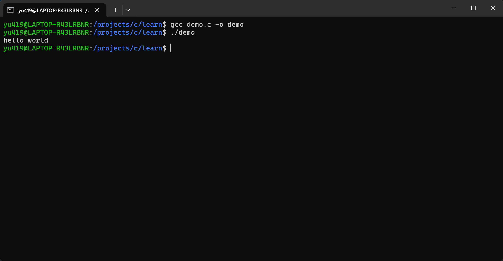

1、GCC全称GNU Compile Collection,是C语言的主要编译器之一，原本是GNU C Compiler，后进行扩展，可用于编译C语言的其他语言而发展为 GNU Complie Collection。MinGW是GCC的一个Windows移植版本，使GCC得以再Windows上运行

2、c_cpp_properties.json是用于智能提示与解析的配置文件  
lanuch.json是配置GBD的文件
tasks.json是构建任务配置，定义如何编译代码

3、
插件的作用一是是IDE具有智能提示，语法识别等功能，方便编写代码，而是可以完成配置，不用手动在terminal输入gcc命令。
  

lanuch.json文件如下
```
  {
    // 使⽤ IntelliSense 了解相关属性。
    // 悬停以查看现有属性的描述。
    // 欲了解更多信息，请访问: https://go.microsoft.com/fwlink/?linkid=830387     "version": "0.2.0",
    "configurations": [
        {
            "name": "gcc.exe - ⽣成和调试活动⽂件",  // 该调试任务的名字，启动调试时会在待选列表中显⽰
            "type": "cppdbg",
            "request": "launch",
            "program": "${fileDirname}\\${fileBasenameNoExtension}.exe",            "args": [],
            "stopAtEntry": false,  //是否再入口停止
            "cwd": "${workspaceFolder}",
            "environment": [],
            "externalConsole": false,  //是否启用外部控制台
            "MIMode": "gdb",
            "miDebuggerPath": "C:\\mingw64\\bin\\gdb.exe",  //使用的Debugger路径
            "setupCommands": [
                {
                    "description": "为 gdb 启⽤整⻬打印",
                    "text": "-enable-pretty-printing",
                    "ignoreFailures": true
                }
            ],
            "preLaunchTask": "C/C++: gcc.exe build active file"  // 调试前的预执⾏任务，这⾥的值是tasks.json⽂件中对应的编译任务，也就是调试前需要先编译
        }
    ]
}
```
内部终端


外部终端

1、变量类型决定了变量储存方式，所占空间大小，以及能对数据所做的操作。储存年龄应该选用整数（选用浮点数未尝不可？）char无法储存单词apple，以为char只能储存1个字符（占单字节），可以使用char*存储。
2、数组索引通常是从0开始。当超出数组有效访问范围时，会访问到垃圾值。在C语言中，arr[i]会被等效为*(arr + i)本质上arr是指向数组起始位置的指针。当数组越界时，访问到其他内存，属于未定义行为。之所以常见且危险是因为编译器并不会报错，但访问到不属于程序的内存，甚至修改这部分内存，会导致影响其他进程。且读取到是数据是无意义的。
3、在for语句中，第一次初始化，判断条件，执行循环体，更新变量，然后重复判断条件，执行循环体，更新变量，while循环每次都会判断条件表达式，然后指向循环体语句。初始化是初始化变量，如果变量声明在初始化表达式内，那么这个变量的作用域就在for内。条件判断用于判断何时退出循环。迭代部分用于更新变量。
while循环每次都会判断条件。do-while循环第一次不会判断条件，后续会判断。

for:
```
int sum = 0;
for(int i = 1;i <= 10;i++){
    sum += i;
}
```
while:
```
int sum = 0;
int i = 1;
while(i <= 10){
    sum += i;
}
```
4、逻辑运算符的的运算对象一般是true(1)和false(0)，运算结果也是true和false，算数运算符的运算对象是整数，浮点数，运算结果也是整数，浮点数。&&代表都是true，结果才为true。||代表有一边为true结果就为true。!代表取反，true为false，false为true


```
void swap(int a, int b){
  int temp = a;
  a = b;
  b = temp;
}

int main(){
  int a = 10;
  int b = 20;
  swap(a, b);
}
```
在上述代码中，swap无法起到交换a,b的作用，因为在函数传参时，会将传入的参数拷贝，传入的a与b并非原始的a,b，考虑这样修改
```
void swap(int* a, int* b){
  int temp = *a;
  *a = *b;
  *b = temp;
}

int main(){
  int a = 10;
  int b = 20;
  swap(&a, &b);
}
```
通过传递指针，因为拷贝后指针的依然指向同一块内存数据，所以可以实现a,b交换
